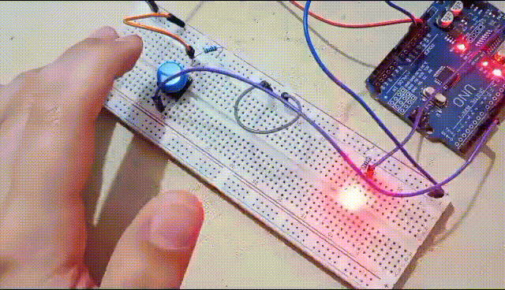
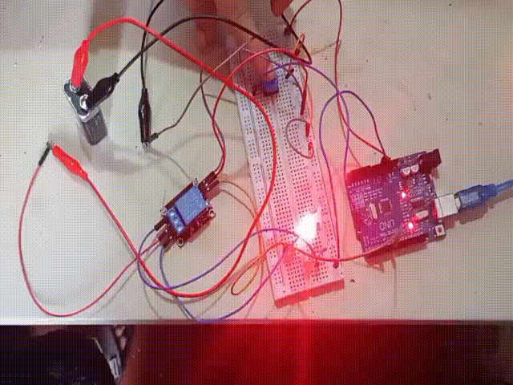

# 🔌 Arduino Projects Portfolio

[English](#english) | [Español](#espanol)

---

## 🇺🇸 English
<a id="english"></a>

A curated collection of **Arduino-based electronics projects**, ranging from fundamental circuits to more complex systems like LED matrices and games.

<p align="center">
  
  
  
  
</p>

---

## 📁 Repository Structure

```
arduino-projects/
├── projects/
│   ├── 01_toggle_led_system/
│   ├── 02_relay_dc_switching/
│   ├── 03_full_8x8_led_matrix_sweep/
│   ├── 04_8x8_led_matrix_drawer/
│   ├── 05_shift_register/
│   ├── 06_led_matrix_shift_register/
│   ├── 07_snake_game/
│   ├── 08_rfid_experiments/
│   └── 09_stepper_velocity_control/
```

> ⚠️ Planned structure (future additions):

```
shared/   # reusable modules and libraries
docs/     # global documentation
tools/    # scripts and utilities
```

---

## 🚀 Projects

### 🔹 01 - Toggle LED System

Basic GPIO control with input/output handling.


---

### 🔹 02 - Relay DC Switching

Controlling higher-power components using relays.



---

### 🔹 03 - Full 8x8 LED Matrix Sweep 

Sequential sweep across an 8x8 LED matrix.


---

### 🔹 04 - 8x8 LED Matrix Drawer

Hardware wiring and implementation guide for the A1088BSDirect 8x8 LED matrix library.

---

### 🔹 05 - Shift Register

Expanding outputs using a 74HC595 shift register.

---

### 🔹 06 - LED Matrix + Shift Register

Combining matrix control with shift registers.

---

### 🔹 07 - Snake Game 🐍

A playable Snake game on an LED matrix.

---

### 🔹 08 - RFID Experiments

Reading and writing RFID tags using the RC522 module.

---

### 🔹 09 - Stepper Velocity Control

Controlling speed and direction of a 28BYJ-48 stepper motor using a potentiometer.

---

## 🧰 Technologies & Tools

* Arduino (UNO / Nano)
* C / C++ (Arduino framework)
* KiCad (schematic design)
* Digital electronics (LEDs, buttons, relays, shift registers)

---

## 📚 What You’ll Find in Each Project

Each project includes:

* 📄 Documentation (`README.md`)
* ⚡ Firmware (`firmware/`)
* 🔌 Hardware design (`hardware/`)

Optional (when applicable):

* 🧪 Simulations (`simulations/`)
* 🎥 Media demos (`media/`)
* 📑 Supporting documents (`docs/`)

---

## 📌 Future Improvements

* 🧩 Add PCB designs (KiCad) for all projects
* 🦀 Implement all projects in Rust (embedded / no_std)
* 📡 Expand into ESP32 and IoT projects
* 🧱 Build reusable modules in `shared/`
* 🧪 Improve simulation coverage
* 🎮 Enhance the Snake game
* 📊 Add performance analysis
* 📹 Improve demos (GIFs/videos)

---

## 🤝 Contributing

This is a personal learning and portfolio repository, but suggestions and ideas are always welcome.

---

## 📄 License

This project is licensed under the terms of the **MIT License**.
See the [LICENSE](./LICENSE) file for details.

---

## 🇪🇸 Español
<a id="espanol"></a>

Una colección de proyectos electrónicos basados en **Arduino**, que van desde circuitos fundamentales hasta sistemas más complejos como matrices LED y juegos.

<p align="center">
  
  
  
  
</p>

---

## 📁 Estructura del Repositorio

```
arduino-projects/
├── projects/
│   ├── 01_toggle_led_system/
│   ├── 02_relay_dc_switching/
│   ├── 03_full_8x8_led_matrix_sweep/
│   ├── 04_8x8_led_matrix_drawer/
│   ├── 05_shift_register/
│   ├── 06_led_matrix_shift_register/
│   ├── 07_snake_game/
│   ├── 08_rfid_experiments/
│   └── 09_stepper_velocity_control/
```

> ⚠️ Estructura planificada (próximas incorporaciones):

```
shared/   # módulos y librerías reutilizables
docs/     # documentación general del repositorio
tools/    # scripts y utilidades
```

---

## 🚀 Proyectos

### 🔹 01 - Sistema de Alternancia de LED

Control básico de GPIO con entradas y salidas.


---

### 🔹 02 - Conmutación de CC por Relé

Control de componentes de mayor potencia mediante relés.


---

### 🔹 03 - Barrido de Matriz LED Completa 8x8

Barrido secuencial a través de una matriz de LEDs de 8x8.


---


### 🔹 04 - Dibujador en Matriz LED de 8x8

Guía de cableado de hardware e implementación para la biblioteca de la matriz LED 8x8 A1088BSDirect.

---

### 🔹 05 - Registro de Desplazamiento

Expansión de salidas usando un 74HC595.

---

### 🔹 06 - Matriz LED + Registro de Desplazamiento

Combinación de matriz con registros para escalabilidad.

---

### 🔹 07 - Juego Snake 🐍

Juego Snake implementado en una matriz LED.

---

### 🔹 08 - Experimentos RFID

Lectura y escritura de tarjetas RFID con RC522.

---

### 🔹 09 - Control de Velocidad de Motor Paso a Paso

Control de velocidad y dirección de un motor 28BYJ-48 con potenciómetro.

---

## 🧰 Tecnologías y Herramientas

* Arduino (UNO / Nano)
* C / C++ (framework Arduino)
* KiCad (diseño de esquemas)
* Electrónica digital (LEDs, botones, relés, registros de desplazamiento)

---

## 📚 Qué Encontrarás en Cada Proyecto

Cada proyecto incluye:

* 📄 Documentación (`README.md`)
* ⚡ Firmware (`firmware/`)
* 🔌 Diseño de hardware (`hardware/`)

Opcional (según corresponda):

* 🧪 Simulaciones (`simulations/`)
* 🎥 Demos (`media/`)
* 📑 Documentación adicional (`docs/`)

---

## 📌 Mejoras Futuras

* 🧩 Agregar diseños PCB para todos los proyectos
* 🦀 Implementar todos los proyectos en Rust
* 📡 Expandir hacia ESP32 / IoT
* 🧱 Crear módulos reutilizables en `shared/`
* 🧪 Mejorar simulaciones
* 🎮 Mejorar el juego Snake
* 📊 Añadir análisis de rendimiento
* 📹 Mejorar demos (videos/GIFs)

---

## 🤝 Contribuciones

Este es un repositorio personal de aprendizaje, pero sugerencias e ideas son bienvenidas.

---

## 📄 Licencia

Este proyecto está bajo la **Licencia MIT**.
Ver el archivo [LICENSE](./LICENSE) para más detalles.
