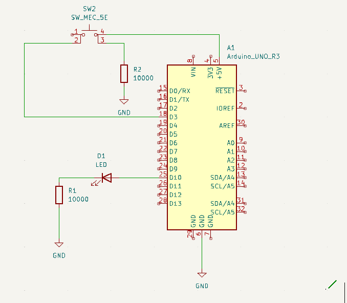

# 01-Blinking led and button

Welcome to the **01-Blinking led and Button** project, the purpose of this  project is to make a led blink or stop blinking pulsing a button

## Overview

This project demonstrates a basic input/output interaction with an Arduino: 
- The LED will blink continuously.
- When the button is pressed, the blinking stops (or resumes if previously stopped).

## Components

- 1x Arduino Uno (or compatible board)
- 1x LED
- 1x Push button
- 2x 10kΩ resistor 
- Breadboard and jumper wires

## Circuit Description

- The LED is connected in series with a 10kΩ resistor to a digital output pin (e.g., pin 13).
- The button is connected to a digital input pin (e.g., pin 4) with a 10kΩ pull-down resistor to ground.
- Pressing the button sends a HIGH signal to the input pin, triggering a state change in the blinking behavior.

## Circuit Diagram

You can find the schematic and wiring diagram in the `circuit/` folder.

