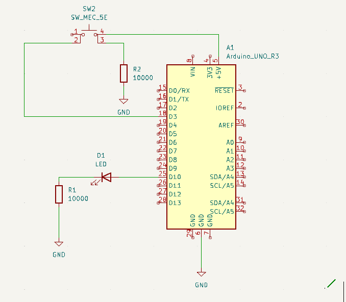

# 🔹 01 - Blinking LED & Button

[English](#english) | [Español](#espanol)

---

## 🇺🇸 English

### Overview
This project is a fundamental introduction to **GPIO (General Purpose Input/Output)** control. It demonstrates how to handle digital output (LED) and digital input (Tactile Switch) simultaneously to toggle the state of a system.

### Features
* **Continuous Blinking**: The LED toggles state at a fixed interval.
* **Input Control**: Pressing the button stops or resumes the blinking behavior.
* **Pull-down Configuration**: Uses a resistor to ensure a stable logic state when the button is open.

### Hardware Components
| Component | Quantity | Description |
| :--- | :--- | :--- |
| **Arduino Uno / Nano** | 1 | Main microcontroller |
| **LED** | 1 | Status indicator |
| **Resistor 220Ω** | 1 | Current limiter for the LED |
| **Resistor 10kΩ** | 1 | Pull-down resistor for the button |
| **Push Button** | 1 | Tactile switch for input |

> [!NOTE]
> For the complete part list, check the [BOM](./hardware/bom.md) in the hardware folder.

### Circuit Design
The LED is connected to a digital output pin, while the button is connected to a digital input pin with a pull-down resistor to ground.

---

## 🇪🇸 Español

### Descripción General
Este proyecto es una introducción fundamental al control de **GPIO (Entrada/Salida de Propósito General)**. Demuestra cómo manejar una salida digital (LED) y una entrada digital (Pulsador) simultáneamente para cambiar el estado de un sistema.

### Características
* **Parpadeo Continuo**: El LED cambia de estado en un intervalo fijo.
* **Control de Entrada**: Al presionar el botón, se detiene o se reanuda el parpadeo.
* **Configuración Pull-down**: Utiliza una resistencia para asegurar un estado lógico estable cuando el botón está abierto.

### Componentes de Hardware
* **Arduino Uno / Nano** (1)
* **LED** (1)
* **Resistencia 220Ω** (1) - *Limitadora para el LED*
* **Resistencia 10kΩ** (1) - *Pull-down para el botón*
* **Pulsador** (1)

> [!NOTE]
> Para la lista completa de piezas, consulta el [BOM](./hardware/bom.md) en la carpeta de hardware.

### Diseño del Circuito
El LED está conectado a un pin de salida digital, mientras que el botón está conectado a un pin de entrada digital con una resistencia pull-down a tierra.

---