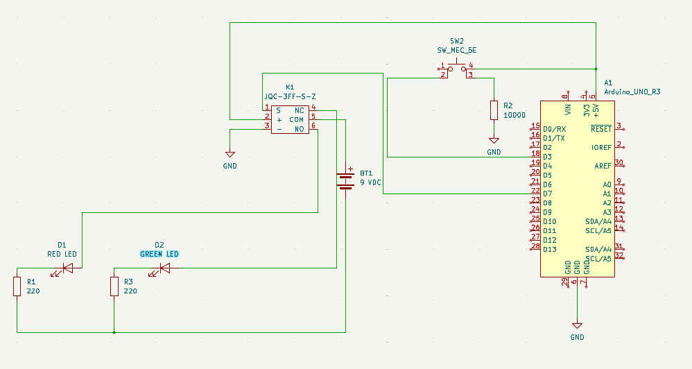
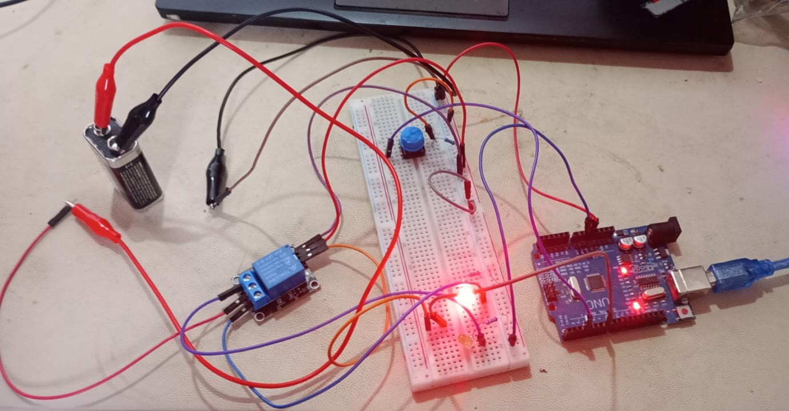
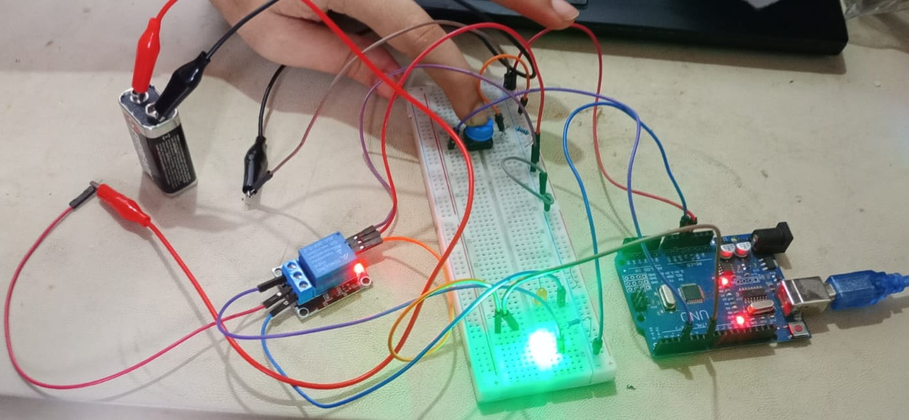

# 🔹 02 - Relay DC Switching / 02 - Conmutación DC mediante Relé

[English](#english) | [Español](#espanol)

---

## 🇺🇸 English

### Overview
This project demonstrates **Power Isolation** using a mechanical relay. The Arduino controls the relay coil (5V), while the relay acts as a bridge to switch a high-voltage/high-current circuit (a 9V battery powering LEDs) safely.

### Features
* **Power Decoupling**: Separates the logic circuit (Arduino) from the load circuit (9V Battery).
* **Bistable Toggling**: Uses a tactile button to toggle the relay state.
* **Dual Status Indication**: Visual feedback for both Normally Closed (NC) and Normally Open (NO) states.

### Hardware Components
| Component | Quantity | Description |
| :--- | :--- | :--- |
| **Arduino Uno / Nano** | 1 | Control logic unit |
| **5V Relay Module** | 1 | Mechanical switch |
| **Tactile Button** | 1 | Toggles the relay state |
| **LEDs (Red/Green)** | 2 | Status indicators |
| **9V Battery** | 1 | External power for the load |

> [!IMPORTANT]
> Detailed specifications and resistors values are available in the [BOM](./hardware/bom.md).

### Circuit Design
The Arduino triggers the relay coil via digital pin 7. The relay's Common (COM) pin is connected to the 9V battery positive terminal, switching power between the Red LED (NC) and Green LED (NO).

---

### Physical Assembly
This is the real-world wiring of the Arduino Uno, the relay, the push button, and the LEDs, using a breadboard for the current-limiting resistors.

#### Mounting Off

 
#### Mounting On

---

## 🇪🇸 Español

### Descripción General
Este proyecto demuestra el **Aislamiento de Potencia** utilizando un relé mecánico. El Arduino controla la bobina del relé (5V), mientras que el relé actúa como un puente para conmutar un circuito de mayor voltaje (una batería de 9V que alimenta LEDs) de forma segura.

### Características
* **Desacoplamiento de Potencia**: Separa el circuito lógico (Arduino) del circuito de carga (Batería 9V).
* **Conmutación Biestable**: Utiliza un pulsador para cambiar el estado del relé.
* **Indicación de Estado Dual**: Retroalimentación visual para los estados Normalmente Cerrado (NC) y Normalmente Abierto (NO).

### Componentes de Hardware
* **Arduino Uno / Nano** (1)
* **Módulo de Relé 5V** (1)
* **Pulsador Táctil** (1)
* **LEDs (Rojo/Verde)** (2)
* **Batería 9V** (1)

> [!IMPORTANT]
> Las especificaciones detalladas y los valores de las resistencias están disponibles en el [BOM](./hardware/bom.md).

### Diseño del Circuito
El Arduino activa la bobina del relé a través del pin digital 7. El pin Común (COM) del relé se conecta al terminal positivo de la batería de 9V, alternando la energía entre el LED Rojo (NC) y el LED Verde (NO).

---

### Montaje Físico
Este es el cableado en el mundo real del Arduino Uno, el relé, el pulsador y los LEDs, utilizando una protoboard para las resistencias limitadoras de corriente.

#### Montaje Apagado

 
#### Montaje Encendido

---