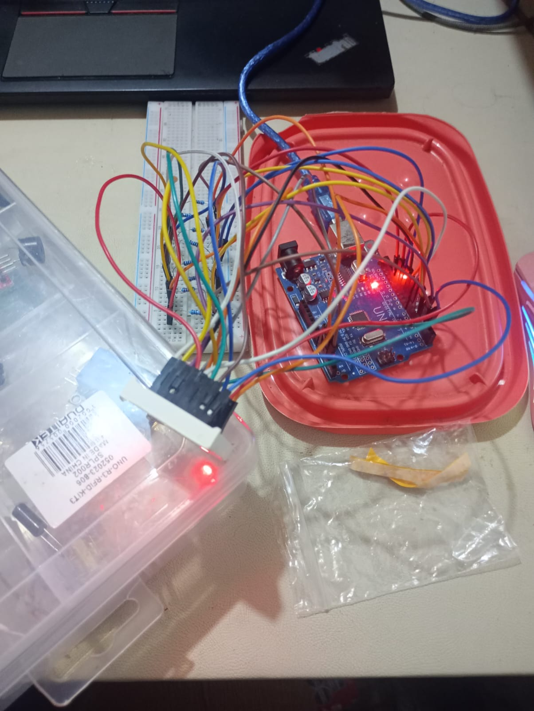

# 🔹 03 - Full 8x8 LED Matrix Sweep / 03 - Barrido de Matriz LED Completa 8x8

[English](#english) | [Español](#espanol)

---

## 🇺🇸 English

### Overview
This project demonstrates manual control of an **8x8 LED Matrix (1088BS)** without using external drivers. The logic focuses on a sweeping pattern across the full 8x8 matrix to illustrate coordinate-based addressing and multiplexing.

### Features
* **Coordinate Mapping**: Direct pin-to-matrix mapping using Arduino digital pins.
* **Ghosting Prevention**: Implementation of high-impedance states and pull-up logic to ensure only the target LED is illuminated.
* **Time-Multiplexed Sweep**: Sequential activation of LEDs via nested software loops.

### Hardware Components
| Component | Quantity | Description |
| :--- | :--- | :--- |
| **Arduino Uno / Nano** | 1 | Control logic unit |
| **1088BS 8x8 LED Matrix** | 1 | Common Anode display |
| **Resistors (220Ω - 1kΩ)** | 8 | Current limiters for active rows |
| **Jumper Wires** | 24+ | Assorted connections |

> [!NOTE]
> For the complete part list, check the [BOM](../../shared/hardware/A-1088B8-Direct/bom.md) in the hardware folder.

## Hardware Documentation

This section contains all technical specifications and wiring diagrams required to interface with the LED Matrix.

### Technical Reference
For specific wiring details and coordinate mapping, refer to the following documents in the `hardware/` folder:

* 📍 [**Pinout Reference**](../../docs/hardware_ref/A-1088B8/pinout_reference.md) — Mapping of physical pins to rows and columns.
* 🔗 [**Connection Guide**](../../shared/hardware/A-1088B8-Direct/connections.md) — Step-by-step wiring for microcontrollers.
* 📄 [**LED Matrix Datasheet**](../../docs/datasheets/A-1088BS-1.pdf) — Full manufacturer specifications.

---

### Circuit Schematic
The matrix is controlled by mapping pins to all 8 rows and 8 columns. Ensure the current-limiting resistors are placed on the anode (row) lines.

---

### Physical Assembly
This is the real-world wiring of the Arduino Uno and the 1088BS matrix using a breadboard for the current-limiting resistors.

 
---

## 🇪🇸 Español

### Resumen
Este proyecto demuestra el control manual de una **Matriz de LEDs 8x8 (1088BS)** sin utilizar controladores externos. La lógica se centra en un patrón de barrido a través de la matriz completa de 8x8 para ilustrar el direccionamiento basado en coordenadas y la multiplexación.

### Características
* **Mapeo de Coordenadas**: Mapeo directo de pin a matriz utilizando los pines digitales de Arduino.
* **Prevención de "Ghosting"**: Implementación de estados de alta impedancia y lógica pull-up para asegurar que solo se ilumine el LED objetivo.
* **Barrido Multiplexado en el Tiempo**: Activación secuencial de LEDs mediante bucles de software anidados.

### Componentes de Hardware
| Componente | Cantidad | Descripción |
| :--- | :--- | :--- |
| **Arduino Uno / Nano** | 1 | Unidad de lógica de control |
| **Matriz de LEDs 8x8 1088BS** | 1 | Pantalla de Ánodo Común |
| **Resistencias (220Ω - 1kΩ)** | 8 | Limitadores de corriente para filas activas |
| **Cables Jumper** | 24+ | Conexiones variadas |

> [!NOTA]
> Para la lista completa de componentes, ver el [BOM](../../shared/hardware/A-1088B8-Direct/bom.md) en la carpeta de hardware.

## Documentación de Hardware 

Esta sección contiene todas las especificaciones técnicas y diagramas de conexión para interactuar con la matriz de LEDs.

### Referencia Técnica 
Para detalles específicos de conexiones y mapeo de coordenadas, vea los siguientes documentos en la carpeta `hardware/`:

* 📍 [**Referencia de Pines**](../../docs/hardware_ref/A-1088B8/pinout_reference.md)  — Mapeo de pines físicos a filas y columnas.
* 🔗 [**Guía de Conexión**](../../shared/hardware/A-1088B8-Direct/connections.md) — Guía paso a paso para cableado a microcontroladores.
* 📄 [**Datasheet de la Matriz de LEDs**](../../docs/datasheets/A-1088BS-1.pdf)  — Especificaciones completas del fabricante.

---

### Esquema del Circuito
La matriz se controla mapeando los pines a las 8 filas y 8 columnas. Asegúrese de que las resistencias limitadoras de corriente estén colocadas en las líneas de ánodo (filas).

---

### Ensamblaje Físico
Este es el cableado real del Arduino Uno y la matriz 1088BS utilizando una protoboard para las resistencias limitadoras de corriente.

