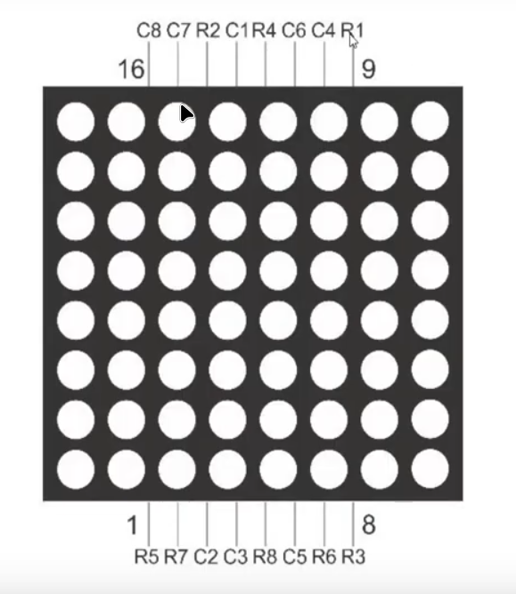
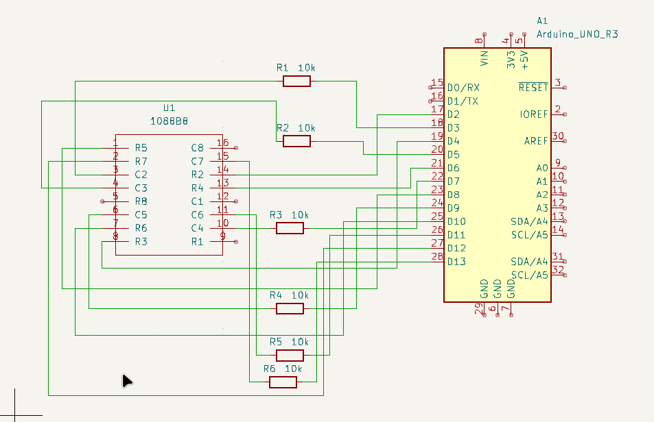

# 🔹 03 - Inner 6x6 Matrix Sweep / 03 - Barrido de Matriz Interna 6x6

[English](#english) | [Español](#espanol)

---

## 🇺🇸 English

### Overview
This project demonstrates manual control of an **8x8 LED Matrix (1088BS)** without using external drivers. The logic focuses on a sweeping pattern across the inner 6x6 grid (Rows 2-7, Columns 2-7) to illustrate coordinate-based addressing and multiplexing.

### Features
* **Coordinate Mapping**: Direct pin-to-matrix mapping using Arduino digital pins.
* **Ghosting Prevention**: Implementation of high-impedance states and pull-up logic to ensure only the target LED is illuminated.
* **Time-Multiplexed Sweep**: Sequential activation of LEDs via nested software loops.

### Hardware Components
| Component | Quantity | Description |
| :--- | :--- | :--- |
| **Arduino Uno / Nano** | 1 | Control logic unit |
| **1088BS 8x8 LED Matrix** | 1 | Common Anode display |
| **Resistors (220Ω - 1kΩ)** | 6 | Current limiters for active rows |
| **Jumper Wires** | 12+ | Assorted connections |

> [!NOTE]
> For the complete part list, check the [BOM](./hardware/bom.md) in the hardware folder.

## Hardware Documentation

This section contains all technical specifications and wiring diagrams required to interface with the LED Matrix.

### Technical Reference
For specific wiring details and coordinate mapping, refer to the following documents in the `hardware/` folder:

* 📍 [**Pinout Reference**](./hardware/pinout_reference.md) — Mapping of physical pins to rows and columns.
* 🔗 [**Connection Guide**](./hardware/connections.md) — Step-by-step wiring for microcontrollers.
* 📄 [**LED Matrix Datasheet**](./docs/A-1088BS-1.pdf) — Full manufacturer specifications.

---

### Circuit Schematic
The matrix is controlled by mapping even-numbered pins (2-12) to rows and odd-numbered pins (3-13) to columns.

---

## 🇪🇸 Español

### Resumen
Este proyecto demuestra el control manual de una **Matriz de LEDs 8x8 (1088BS)** sin utilizar controladores externos. La lógica se centra en un patrón de barrido a través de la rejilla interna de 6x6 (Filas 2-7, Columnas 2-7) para ilustrar el direccionamiento basado en coordenadas y la multiplexación.

### Características
* **Mapeo de Coordenadas**: Mapeo directo de pin a matriz utilizando los pines digitales de Arduino.
* **Prevención de "Ghosting"**: Implementación de estados de alta impedancia y lógica pull-up para asegurar que solo se ilumine el LED objetivo.
* **Barrido Multiplexado en el Tiempo**: Activación secuencial de LEDs mediante bucles de software anidados.

### Componentes de Hardware
| Componente | Cantidad | Descripción |
| :--- | :--- | :--- |
| **Arduino Uno / Nano** | 1 | Unidad de lógica de control |
| **Matriz de LEDs 8x8 1088BS** | 1 | Pantalla de Ánodo Común |
| **Resistencias (220Ω - 1kΩ)** | 6 | Limitadores de corriente para filas activas |
| **Cables Jumper** | 12+ | Conexiones variadas |

> [!NOTE]
> Para la lista completa de piezas, consulta el [BOM](./hardware/bom.md) en la carpeta de hardware.

## Documentación de Hardware

Esta sección contiene todas las especificaciones técnicas y diagramas de cableado necesarios para interactuar con la Matriz de LEDs.

### Referencia Técnica
Para detalles específicos de cableado y mapeo de coordenadas, consulta los siguientes documentos en la carpeta `hardware/`:

* 📍 [**Referencia de Pinout**](./hardware/pinout_reference.md) — Mapeo de pines físicos a filas y columnas.
* 🔗 [**Guía de Conexión**](./hardware/connections.md) — Cableado paso a paso para microcontroladores.
* 📄 [**Datasheet de la Matriz LED**](./docs/A-1088BS-1.pdf) — Especificaciones completas del fabricante.

---

### Esquema del Circuito
La matriz se controla mapeando los pines pares (2-12) a las filas y los pines impares (3-13) a las columnas.

