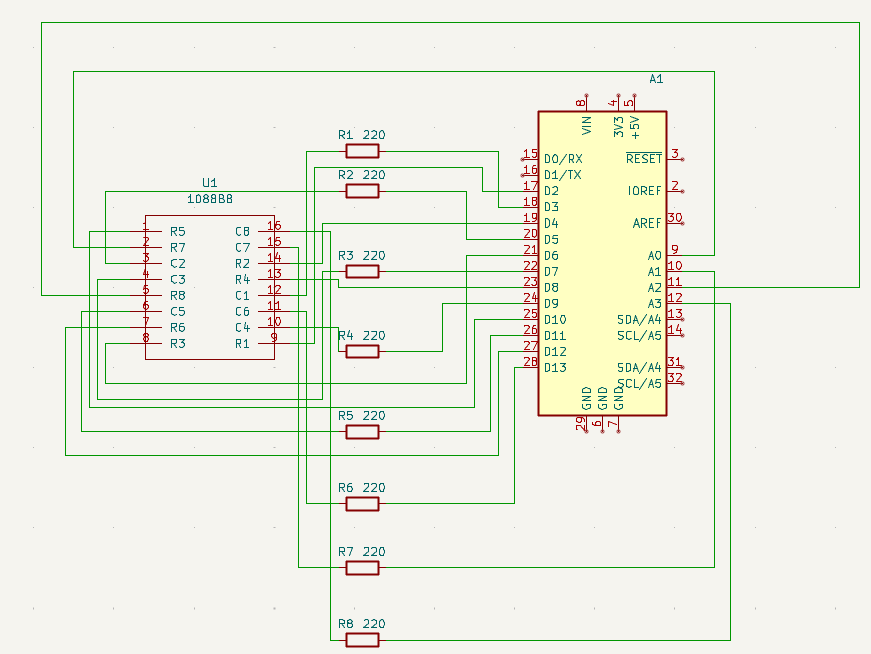
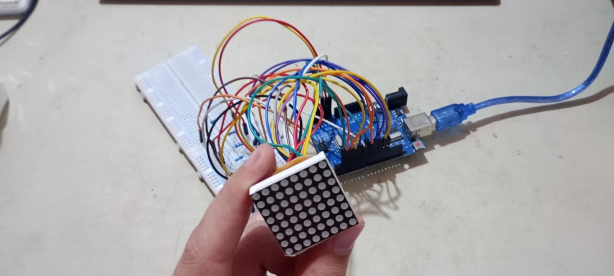

# 🔹 04 -  LED Matrix Drawer / 04 - Dibujador para Matriz LED

[English](#english) | [Español](#espanol)

---

## 🇺🇸 English

### Overview
This project is a practical guide and **use-case example** for the **A1088BSDirect Library**. While the library encapsulates all the complex multiplexing logic, frame drawing, and animation engines, this repository provides the **physical implementation**: detailed wiring instructions, hardware connections, and a clean example code that simply calls the library's built-in functions to demonstrate its capabilities on a **1088BS 8x8 LED matrix**.

### 📚 Library Reference
To install the driver or explore the internal logic (multiplexing, ghosting prevention, calibrated timing), visit the main library repository:
👉 **[A1088BSDirect Library README](../../shared/firmware/lib_a1088bs_direct/README.md)**

### What this Project Covers
* **Hardware Setup**: Detailed schematics for connecting the 16-pin matrix to an Arduino.
* **Wiring Documentation**: Pin-to-pin mapping required for the library's default configuration.
* **Implementation Example**: A simple sketch that demonstrates calling `displayFrame()` and `playAnimation()` without needing to write low-level code.
* **Visual Clarity**: Guidance on using resistors to ensure a crisp, flicker-free display.

### Hardware Components

| Component | Quantity | Description |
| :--- | :--- | :--- |
| **Arduino Uno / Nano** | 1 | Control logic unit |
| **1088BS 8x8 LED Matrix** | 1 | Common Anode display |
| **Resistors (220Ω - 1kΩ)** | 8 | Current limiters for cathode lines |
| **Jumper Wires** | 24+ | Assorted connections |

> [!NOTE]
> For the complete part list, check the [BOM](../../shared/hardware/A-1088B8-Direct/bom.md) in the hardware folder.

## Hardware Documentation

This section contains technical specifications and wiring diagrams required to interface with the library.

### Technical Reference

For specific wiring details and coordinate mapping, refer to the following documents:

* 📍 [**Pinout Reference**](../../docs/hardware_ref/A-1088B8/pinout_reference.md) — Mapping of physical pins to rows and columns.

* 🔗 [**Connection Guide**](../../shared/hardware/A-1088B8-Direct/connections.md) — Step-by-step wiring for microcontrollers.

* 📄 [**LED Matrix Datasheet**](../../docs/datasheets/A-1088BS-1.pdf) — Full manufacturer specifications.

### Circuit Schematic

The library uses **row-at-a-time multiplexing**. To enable full functionality, the wiring maps 16 Arduino pins to the matrix.

### Physical Assembly

This is the real-world wiring of the Arduino Uno and the 1088BS matrix using a breadboard for the current-limiting resistors.

#### Pinnout Assembly

#### Screen Assembly

## 🇪🇸 Español

### Resumen
Este proyecto es una guía práctica y un **ejemplo de caso de uso** para la **Librería A1088BSDirect**. Mientras que la librería encapsula toda la lógica compleja de multiplexado, dibujo de cuadros y motores de animación, este repositorio proporciona la **implementación física**: instrucciones detalladas de cableado, conexiones de hardware y un código de ejemplo limpio que simplemente llama a las funciones integradas de la librería para demostrar sus capacidades en una **matriz LED 1088BS de 8x8**.

### 📚 Referencia de la Librería
Para instalar el controlador o explorar la lógica interna (multiplexado, prevención de ghosting, tiempos calibrados), visite el repositorio de la libreria:
👉 **[README de la Librería A1088BSDirect](../../shared/firmware/lib_a1088bs_direct/README.md)**

### Contenido del Proyecto
* **Configuración de Hardware**: Esquemas detallados para conectar los 16 pines de la matriz al Arduino.
* **Documentación de Cableado**: Mapeo pin a pin necesario para la configuración por defecto de la librería.
* **Ejemplo de Implementación**: Un sketch simple que demuestra cómo llamar a `displayFrame

### Componentes de Hardware

| Componente | Cantidad | Descripción |
| :--- | :--- | :--- |
| **Arduino Uno / Nano** | 1 | Unidad de lógica de control |
| **Matriz de LEDs 8x8 1088BS** | 1 | Pantalla de Ánodo Común |
| **Resistencias (220Ω - 1kΩ)** | 8 | Limitadores para líneas de cátodo |
| **Cables Jumper** | 24+ | Conexiones variadas |

> [!NOTA]
> Para la lista completa de componentes, ver el [BOM](../../shared/hardware/A-1088B8-Direct/bom.md) en la carpeta de hardware.

## Documentación de Hardware

Esta sección contiene las especificaciones técnicas y diagramas de conexión necesarios para la librería.

### Referencia Técnica

Para detalles específicos de conexiones y mapeo de coordenadas, vea los siguientes documentos:

* 📍 [**Referencia de Pines**](../../docs/hardware_ref/A-1088B8/pinout_reference.md) — Mapeo de pines físicos a filas y columnas.

* 🔗 [**Guía de Conexión**](../../shared/hardware/A-1088B8-Direct/connections.md) — Guía paso a paso para cableado a microcontroladores.

* 📄 [**Datasheet de la Matriz de LEDs**](../../docs/datasheets/A-1088BS-1.pdf) — Especificaciones completas del fabricante.

### Esquema del Circuito

La librería utiliza **multiplexado por filas**. Para habilitar la funcionalidad completa, el cableado mapea 16 pines de Arduino a la matriz.

### Montaje Físico
Este es el cableado real del Arduino Uno y la matriz 1088BS utilizando una protoboard para las resistencias limitadoras de corriente.

#### Montaje de Pines

#### Montaje de Pantalla
