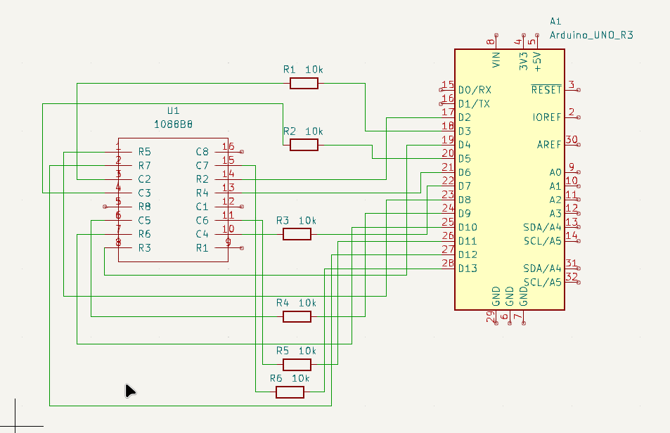

# 05 - LED Matrix Sweep

Welcome to the **05 - LED Matrix Sweep** project! 
In this project, we'll develop an Arduino library to control a subset of an 8×8 LED matrix. The library will support displaying a static image or sweeping through a sequence of images to create animation effects.

Only the inner 6×6 area of the matrix (rows 2–7, columns 2–7) is used, leaving the outermost rows and columns unused. The LED matrix will be driven using a row-at-a-time sweep technique, creating the illusion of a stable image by rapidly refreshing each row in succession.

The library will provide functions to:

- Display a single image on the 6×6 area.
- Sweep through a list of images with configurable frame delays and durations.
- Abstract away low-level pin control and timing logic for easy reuse.

This approach allows for modular and efficient control of 2D LED patterns, ideal for projects involving simple graphics or animated icons.

---

## Components

- 1 × Arduino UNO  
- 1 × 1088B8 8×8 LED Matrix  
- 6 × 10kΩ Resistors  
- Breadboard and jumper wires  

## Led matrix pinout

[Pinout reference](./asets/Pinout%20reference.md)

[Conections](./asets/Conections.md)

## Circuit Description

The 1088B8 LED matrix has 8 anode pins (rows) and 8 cathode pins (columns), connected in a specific pattern. We connect:

- **Even-numbered Arduino pins (2, 4, 6, 8, 10, 12)** to **row pins (anodes)** of the LED matrix from row 2 to 7.
- **Odd-numbered Arduino pins (3, 5, 7, 9, 11, 13)** to **column pins (cathodes)** of the LED matrix from column 2 to 7.

The code dynamically switches these pins HIGH and LOW to activate specific LEDs in a time-multiplexed fashion.

To prevent ghosting and LED backfeed, all unused cathodes are held HIGH (so they don’t sink current) while only one is pulled LOW at a time.

---

## Circuit Diagram

You can find the schematic and wiring diagram and the library for the led matrix in the `circuit/` folder.

