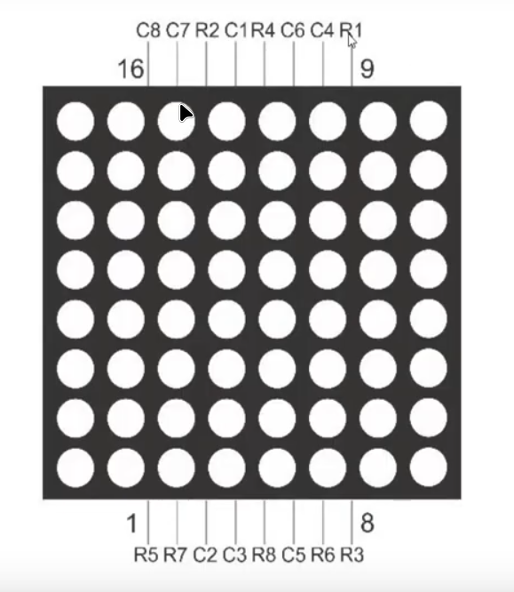

# 07 - LED matrix and shift register

Welcome to the **07 ‑ LED matrix and shift register** project!  
In this project, we'll develop an Arduino library to control an 8 × 8 LED matrix with the help of a 74HC595 shift register. The library will support displaying a static image **or** sweeping through a sequence of images to create simple animations.

---

## Overview

Driving an 8 × 8 LED matrix directly from an Arduino would require 16 I/O pins. By introducing a 74HC595 shift register we can reduce that to **11 digital pins** while still keeping all columns individually addressable:

1. **Rows** (8 pins) are driven **directly** by the Arduino.
2. **Columns** (8 pins) are driven by the shift register. Only **3** Arduino pins (data, clock and latch) are needed to feed and update the register.

The library implements a **row‑scanning** technique:

- One row is activated at a time.
- The corresponding 8‑bit pattern is shifted into the 74HC595, lighting the desired LEDs in that row.
- This happens fast enough (> 500 Hz refresh) that the human eye perceives a stable image.

Because the LED matrix is multiplexed, the **average current** through each LED is 1⁄8 of the peak current, so you can often omit individual series resistors on the common‑row side—yet adding **220 Ω** resistors per column is the safest choice when experimenting.

---

## Components

| Qty | Component | Notes |
|:--:|-----------|-------|
| 1 | **Arduino UNO / Nano / Pro Mini** | Any 5 V‑compatible board will work |
| 1 | **8 × 8 LED matrix** (common‑cathode, model 1088B8) | Common‑cathode version expected by the wiring below |
| 1 | **74HC595** 8‑bit shift register | SOIC or DIP |
| 8 | **220 Ω resistors** (optional but recommended) | Limit column current |
| 1 | Breadboard & jumper wires | |
| 1 | 100 nF ceramic capacitor | Decoupling for the 74HC595 |
| – | External 5 V PSU (optional) | Use if total current > 200 mA |

> **Tip:** If you need higher brightness, add **eight NPN transistors (e.g. 2N2222)** between the row pins and GND so the Arduino only drives transistor bases.

---

## LED matrix pinout

[Pinout reference](./asets/Pinout%20reference.md)  |  [Connections](./asets/Conections.md)

---

## Circuit Description

1. **Rows (cathodes)** — The eight row pins of the 1088B8 matrix are connected **directly** to Arduino digital pins 2 – 9 (see table below). Setting a row pin **LOW** sinks current and activates that row.
2. **Columns (anodes)** — The eight column pins are wired to the outputs QA…QH of the 74HC595. Driving a 74HC595 output **HIGH** lights the corresponding LED in the active row.
3. **74HC595 control lines**
   - **SER** (data) → Arduino D10
   - **SRCLK** (clock) → Arduino D12
   - **RCLK** (latch) → Arduino D11
   - **\\OE** tied to GND (always enabled) or to Arduino D6 for software brightness control (PWM)
   - **\\SRCLR** tied to VCC (inactive) or to Arduino D5 for optional reset capability
4. **Power & decoupling** — Connect **VCC** (pin 16) to 5 V and **GND** (pin 8) to ground. Place the 100 nF capacitor across VCC‑GND as close to the IC as possible.

---

## Circuit Diagram

You can find the complete schematic (KiCad + PDF) and a breadboard wiring diagram in the `circuit/` folder, alongside the Arduino library source code.

---