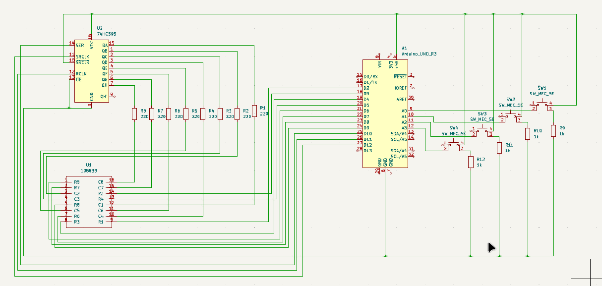

# 08 ‑ Snake game

Welcome to the **08 ‑ Snake game** project!  
In this project, we'll develop an Arduino library to control an 8 × 8 LED matrix with the help of a 74HC595 shift register and four buttons to play the smake game.

---

## Overview

This project uses:
- An **8×8 LED matrix (1088B8)** to display the snake
- A **74HC595 shift register** to control the LED columns
- Arduino digital pins to drive the LED rows
- **Four directional buttons** (UP, DOWN, LEFT, RIGHT) for controlling the snake

We’ll later expand this project with additional features, PCB design, and even 3D-printed enclosures.

---

## Components

- Arduino UNO  
- LED matrix 1088B8  
- 74HC595 shift register  
- 4x Push Buttons  
- Resistors (10kΩ recommended for pull-downs)  
- Breadboard and jumper wires  
- Optional: Capacitor for 74HC595 stability  

---

## LED matrix pinout

[Pinout reference](./asets/Pinout%20reference.md)  |  [Connections](./asets/Conections.md)

---

## Circuit Description

- Rows of the LED matrix are connected directly to Arduino pins D2 through D9.
- Columns are controlled using a 74HC595 shift register to reduce the number of pins used.
- The shift register is connected to D10 (SER), D11 (RCLK), and D12 (SRCLK).
- Buttons are connected to analog pins A0–A3, each with a unique set of connections to detect directional input.
- Control signals and logic are managed by the Arduino sketch to scan rows and update columns through the shift register.

---

## Circuit Diagram

You can find the complete schematic (KiCad + PDF) and a breadboard wiring diagram in the `circuit/` folder, alongside the Arduino library source code.

---

## Pending Features

1. Add a pause/start and reset buttons
2. Add an extra shift register
3. Create the PCB design for the display and the shift registers
4. Create the PCB design for the controller
5. Create a 3d print for the controller casing