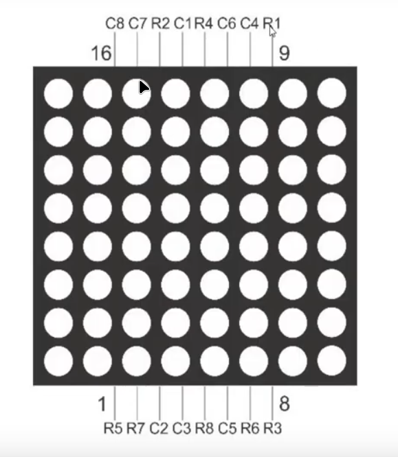

# 07 - LED matrix and shift register

Welcome to the **08 ‑ Snake game** project!  
In this project, we'll develop an Arduino library to control an 8 × 8 LED matrix with the help of a 74HC595 shift register and four buttons to play the smake game.

---

## Overview

---

## Components

---

## LED matrix pinout

[Pinout reference](./asets/Pinout%20reference.md)  |  [Connections](./asets/Conections.md)

---

## Circuit Description

---

## Circuit Diagram

You can find the complete schematic (KiCad + PDF) and a breadboard wiring diagram in the `circuit/` folder, alongside the Arduino library source code.

---