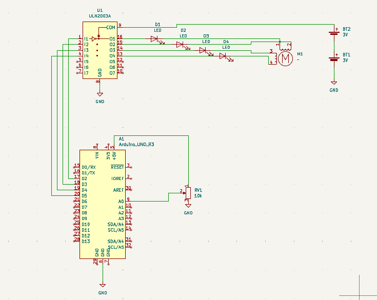

# 10-Stepper-Velocity-Control

Bienvenido al proyecto **10-Stepper-Velocity-Control**.  
El propósito de este proyecto es controlar la **velocidad y dirección** de un **motor paso a paso 28BYJ-48** utilizando un **Arduino UNO** con la libreria **stepper**, una **placa driver ULN2003**, un **potenciómetro** y una **fuente de alimentación externa de 6 V formada por 4 baterías AAA**.

El potenciómetro se utiliza como entrada analógica, donde **la mitad de su recorrido controla la rotación en sentido antihorario** y **la otra mitad controla la rotación en sentido horario**, quedando el motor detenido en la posición central.

---

## Descripción General

En este proyecto, el **Arduino UNO** lee la posición de un **potenciómetro** conectado a su entrada analógica (A0). El valor analógico (0–1023) se utiliza para determinar tanto la **dirección** como la **velocidad** de un **motor paso a paso 28BYJ-48**.

El motor es controlado a través de un **arreglo de transistores Darlington ULN2003**, mientras que se alimenta mediante un **paquete de baterías externo de 6 V (4 baterías AAA)**. El Arduino se alimenta por separado (vía USB) y solo se encarga de la lógica de control.

---

## Mapeo de la Señal del Potenciómetro

El potenciómetro funciona como un **divisor de tensión**, generando un voltaje entre **0 V y 5 V**, que el Arduino convierte en un valor digital entre **0 y 1023**.

Este rango se divide en dos mitades:

- **0 – 511** → Rotación en sentido antihorario  
  - 0 = velocidad máxima  
  - 511 = detenido  

- **512 – 1023** → Rotación en sentido horario  
  - 512 = detenido  
  - 1023 = velocidad máxima  

---

### De dónde sale la velocidad máxima

En los motores paso a paso, la **velocidad máxima no es un valor fijo único** como en los motores DC. En su lugar, se deduce a partir de las **frecuencias de paso indicadas en el datasheet**, combinadas con el **ángulo de paso** y, en este caso, la **reducción de la caja de engranajes**.

Según el datasheet:

- **Ángulo de paso (motor interno)**: `5.625°`
- **Reducción de engranajes**: `64 : 1`

Esto determina la cantidad de pasos por revolución del eje de salida:


``` math
  360° / (5.625° / 64) ≈ 4096 steps
```
Entonces:

> **4096 pasos = 1 vuelta completa del eje de salida**

---

### Especificaciones clave relacionadas con la velocidad

Los parámetros más relevantes del datasheet son:

- **Frecuencia nominal**: `100 Hz`
- **Frecuencia máxima de arranque (idle in-traction)**: `> 600 Hz`
- **Frecuencia máxima en marcha (idle out-traction)**: `> 1000 Hz`

En términos prácticos:

- **100 Hz** → funcionamiento seguro y confiable, con torque utilizable  
- **600 Hz** → frecuencia más alta a la que el motor puede **arrancar desde reposo**  
- **1000 Hz** → frecuencia más alta que el motor puede **mantener una vez que ya está girando**, sin carga

---

### Conversión de frecuencia a RPM (eje de salida)

Fórmula:

``` math
  RPM = (frequency × 60) / steps_per_revolution
```
**Velocidad segura de trabajo (recommendada):**

``` math
  RPM = (100 × 60) / 4096 ≈ 1.46 RPM
```

**Limite superior practico (ya girando, sin carga):**

``` math
  RPM = (1000 × 60) / 4096 ≈ 14.6 RPM
```

### Conclusión práctica en el mundo real

- ✅ **Velocidad usable y confiable**: **1–5 RPM**
- ⚠️ **Límite práctico superior**: **~10–15 RPM**
- ❌ **Por encima de este rango**:
  - Pérdida de pasos
  - Torque prácticamente nulo
  - Zumbido audible con poca o ninguna rotación


#### Cálculo del tiempo entre pasos y retardos

Para controlar la velocidad de un motor paso a paso, calculamos el **tiempo entre pasos** en función de la velocidad de rotación deseada.

### Tiempo por paso


``` math
  t_step = 60 / (velocidad × pasosPorRevolucion)
```

Donde:
- `t_step` → tiempo de un solo paso (segundos)
- `velocidad` → velocidad del motor en **RPM**
- `pasosPorRevolucion` → número total de pasos para una revolución completa

Esta fórmula convierte las RPM (revoluciones por minuto) en el retardo necesario entre pasos individuales.

### Ventana máxima de retardo

``` math
  steps = maxDelay / t_step
```

Si se conoce el tiempo de retardo disponible, esta fórmula nos indica cuántos pasos pueden ejecutarse dentro de esa ventana.

### Expresión combinada

Sustituyendo `t_step` en la ecuación:


``` math
  steps = (maxDelay × velocidad × pasosPorRevolucion) / 60
```


Por ejemplo, si `maxDelay = 30 ms`:


``` math
  steps = (30 / 1000 )× velocidad × pasosPorRevolucion/ 60
```
reduciendo tenemos:

``` math
  steps = velocidad × pasosPorRevolucion/2000
```


sustituyendo del datasheet

``` math
  steps = velocidad × 4096/2000
```

aproximadamaente

``` math
  steps=velocidad  × 2
```
---
## Comportamiento

- Al girar el potenciómetro completamente hacia la **izquierda**, el motor gira a **velocidad máxima en sentido antihorario**.
- A medida que el potenciómetro se acerca a la **posición central**, el motor **disminuye su velocidad** hasta **detenerse**.
- Al pasar el punto central, se produce un **cambio en la dirección de giro**.
- Al girar el potenciómetro completamente hacia la **derecha**, la velocidad aumenta en **sentido horario** hasta alcanzar la **velocidad máxima**.

---

## Componentes

- **Arduino UNO**  
  Lee el valor del potenciómetro y genera las señales de control para el motor paso a paso.

- **Motor Paso a Paso 28BYJ-48 (5 V)**  
  Motor paso a paso unipolar utilizado para el control de velocidad y dirección.

- **Placa Driver ULN2003 para Motor Paso a Paso**  
  Proporciona amplificación de corriente y protege los pines de E/S del Arduino.

- **Potenciómetro (por ejemplo, 10 kΩ)**  
  Utilizado para controlar la velocidad y la dirección.

- **4 baterías AAA (≈6 V en total)**  
  Fuente de alimentación externa para el motor paso a paso.

- **Porta baterías para 4 celdas AAA**

- **Cables jumper**

---

## Estrategia de Alimentación

- El **motor paso a paso y el ULN2003** se alimentan mediante una **fuente externa de 6 V** formada por **4 baterías AAA conectadas en serie**.
- El **Arduino UNO se alimenta vía USB**.
- El Arduino **no alimenta el motor**.

Esta separación mejora la estabilidad y evita caídas de tensión o reinicios causados por los picos de corriente del motor.

---

## Descripción del Circuito

### Potenciómetro
- Un pin exterior → **5 V del Arduino**
- El otro pin exterior → **GND del Arduino**
- Pin central (cursor) → **A0 del Arduino**

### Driver ULN2003
- **IN1–IN4** → Pines digitales de salida del Arduino
- **GND** → **GND del Arduino**
- **VCC** → **+6 V del paquete de baterías AAA**

### Motor Paso a Paso
- Conectado directamente al conector del motor en la placa ULN2003

### Referencia de Tierra (Crítico)
El **terminal negativo del paquete de baterías DEBE estar conectado al GND del Arduino** para asegurar una referencia común para las señales de control.

---

## Notas y Advertencias

- **NO** conectar el paquete de baterías de 6 V al pin **5 V** del Arduino.
- **NO** alimentar el motor paso a paso desde el Arduino.
- Asegurarse de que todas las tierras (GND) estén conectadas.
- Si el motor se calienta o se traba, desconectar la alimentación inmediatamente.

---

## Diagrama del Circuito

El esquema y el diagrama de cableado se encuentran en la carpeta `circuit/`.

